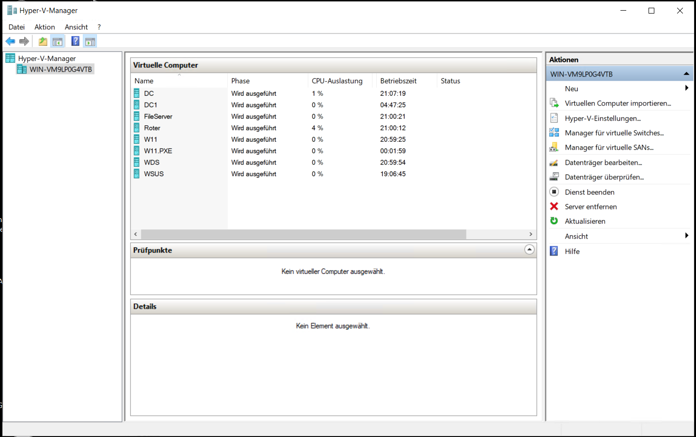
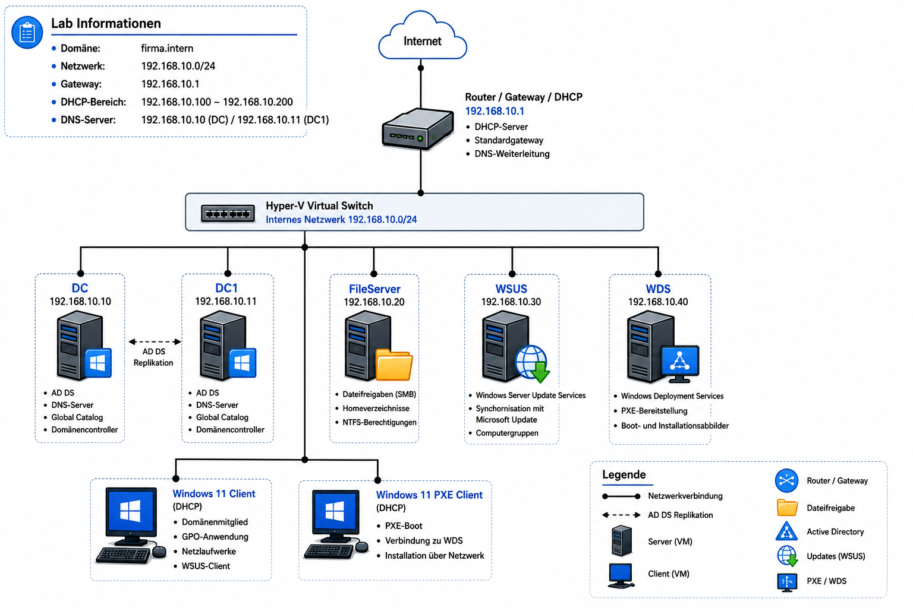

# Windows Server Infrastruktur mit Hyper-V

Eine vollständig virtualisierte Windows-Server-Infrastruktur zur Simulation einer zentral verwalteten Unternehmensumgebung.

Das Projekt wurde im Rahmen meiner Umschulung zum **Fachinformatiker für Systemintegration** umgesetzt und dokumentiert den Aufbau einer Active-Directory-Domäne innerhalb einer Microsoft-Hyper-V-Umgebung.

---

## Über dieses Projekt

Im Rahmen dieses Projekts wurde eine Windows-Server-Infrastruktur innerhalb einer Microsoft-Hyper-V-Umgebung aufgebaut und vollständig konfiguriert.

Die Laborumgebung bildet eine typische Unternehmensumgebung nach und umfasst mehrere virtuelle Windows-Server sowie einen Windows-11-Client.

Alle implementierten Dienste wurden erfolgreich eingerichtet, miteinander integriert und im Rahmen einer abschließenden Funktionsprüfung überprüft.

---

## Hyper-V-Laborumgebung

Die folgende Abbildung zeigt die in Microsoft Hyper-V eingerichtete Laborumgebung mit sämtlichen virtuellen Maschinen.

---

## Netzwerkübersicht

Die folgende Abbildung zeigt den logischen Aufbau der Laborumgebung sowie die Kommunikation der einzelnen Systeme innerhalb der Domäne.

---

## Eingesetzte Technologien

- Microsoft Hyper-V
- Windows Server 2022
- Windows 11
- Active Directory Domain Services (AD DS)
- Domain Name System (DNS)
- Dynamic Host Configuration Protocol (DHCP)
- Group Policy Objects (GPO)
- Server Message Block (SMB)
- New Technology File System (NTFS)
- Windows Server Update Services (WSUS)
- Windows Deployment Services (WDS)

---

## Dokumentation

Die vollständige Projektdokumentation beschreibt den Aufbau, die Konfiguration sowie die Überprüfung der einzelnen implementierten Windows-Serverdienste.

- [01 – Projektbeschreibung](docs/01-Projektbeschreibung.md)
- [02 – Infrastruktur](docs/02-Infrastruktur.md)
- [03 – Active Directory-Domäne](docs/03-Active-Directory-Domäne.md)
- [04 – DNS-Server](docs/04-DNS-Server.md)
- [05 – DHCP-Server](docs/05-DHCP-Server.md)
- [06 – Dateidienste und Berechtigungen](docs/06-Dateidienste-und-Berechtigungen.md)
- [07 – Gruppenrichtlinienverwaltung](docs/07-Gruppenrichtlinienverwaltung.md)
- [08 – Windows Server Update Services](docs/08-Windows-Server-Update-Services.md)
- [09 – Windows Deployment Services](docs/09-Windows-Deployment-Services.md)
- [10 – Funktionsprüfung](docs/10-Funktionsprüfung.md)

---

## Ausblick

Dieses Repository dokumentiert den aktuellen Stand der aufgebauten Laborumgebung.

Zur fachlichen Weiterentwicklung könnten unter anderem folgende Themen ergänzt werden:

- Automatisierung mit PowerShell
- Windows Admin Center
- Active Directory Certificate Services (AD CS)
- DFS Namespace
- Backup- und Wiederherstellung
- Infrastrukturüberwachung

---

## Projektstatus

Die in diesem Repository dokumentierte Windows-Server-Infrastruktur wurde vollständig aufgebaut, konfiguriert und erfolgreich getestet.

Alle implementierten Serverrollen arbeiten innerhalb der Laborumgebung zusammen und wurden anhand praktischer Funktionstests überprüft.

---

## Autor

**Sharif Rahmatzai**

Umschüler zum Fachinformatiker für Systemintegration (IHK)
