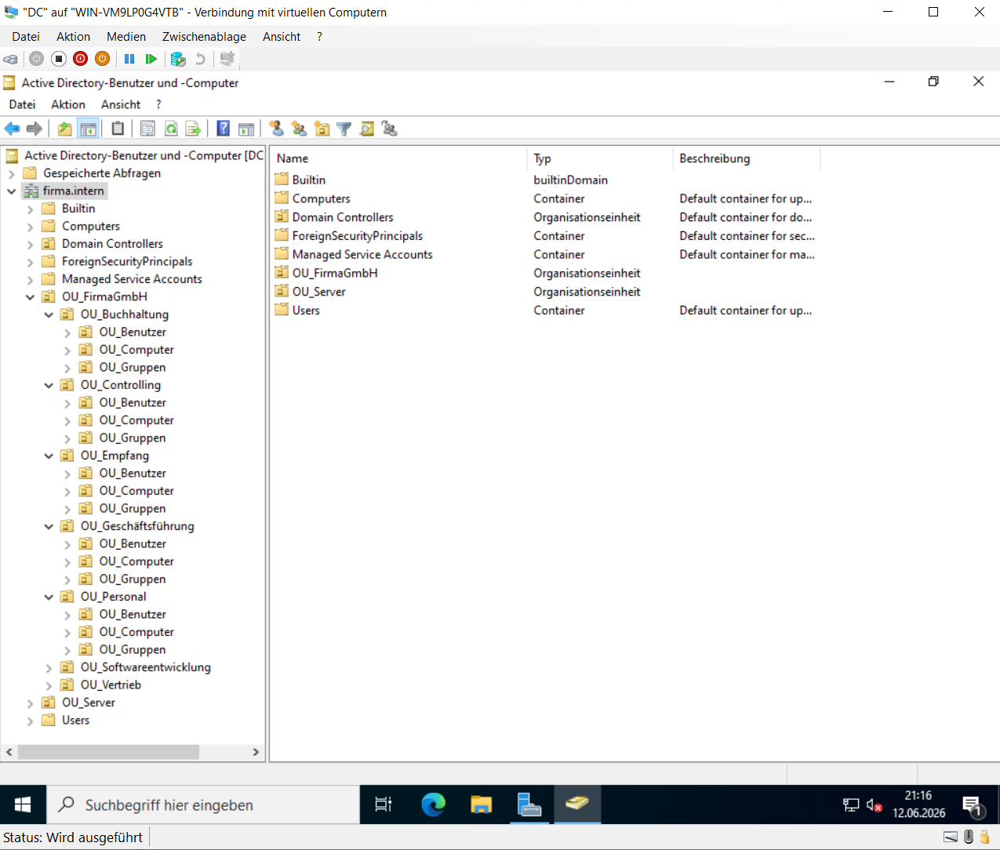
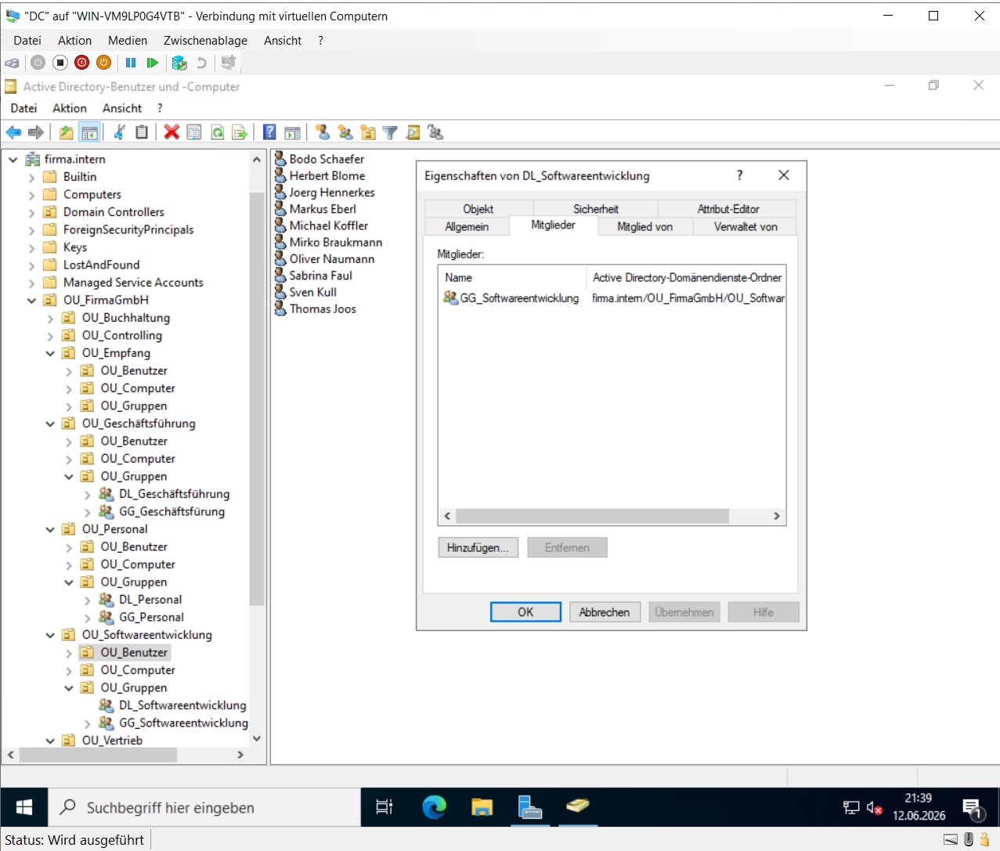

# Active Directory-Domäne

## Einleitung

Zur zentralen Verwaltung der Benutzer, Gruppen und Computer wurde eine Active-Directory-Domäne eingerichtet.

Sie bildet die Grundlage der gesamten Windows-Server-Infrastruktur und ermöglicht die zentrale Administration aller Domänenobjekte sowie die Umsetzung eines strukturierten Berechtigungskonzepts.

---

## Domänenstruktur

Für die Domäne **firma.intern** wurden zwei Domänencontroller eingerichtet.

Die Organisationsstruktur wurde mithilfe von Organisationseinheiten (Organizational Units, OU) aufgebaut. Dadurch können Benutzer, Gruppen und Computer logisch voneinander getrennt und zentral verwaltet werden.

Für die einzelnen Unternehmensbereiche wurden folgende Organisationseinheiten eingerichtet:

- Buchhaltung
- Controlling
- Empfang
- Geschäftsführung
- Personal
- Softwareentwicklung
- Vertrieb

Zusätzlich wurden separate Organisationseinheiten für Benutzer, Gruppen und Computer erstellt.

---

## Benutzer- und Gruppenverwaltung

Für jede Abteilung wurden entsprechende Benutzerkonten und Sicherheitsgruppen angelegt.

Die Benutzer werden den jeweiligen Gruppen zugeordnet, wodurch Berechtigungen zentral verwaltet und Änderungen innerhalb der Organisationsstruktur einfacher umgesetzt werden können.

Diese Struktur erleichtert sowohl die Administration als auch die spätere Vergabe von Zugriffsrechten.

---

## AGDLP-Berechtigungskonzept

Für die Berechtigungsvergabe wurde das **AGDLP-Prinzip** umgesetzt.

Dabei werden Benutzer zunächst globalen Gruppen zugeordnet. Diese Gruppen werden anschließend Mitglied einer domänenlokalen Gruppe, welche die eigentlichen Berechtigungen auf freigegebene Ressourcen besitzt.

Durch diese Vorgehensweise lassen sich Berechtigungen zentral verwalten und bei organisatorischen Änderungen flexibel anpassen, ohne NTFS-Berechtigungen direkt verändern zu müssen.

---

## Überprüfung

Nach der Einrichtung der Domänenstruktur wurde überprüft, ob:

- die Organisationseinheiten korrekt erstellt wurden,
- Benutzer den vorgesehenen Gruppen zugeordnet sind,
- das AGDLP-Berechtigungskonzept ordnungsgemäß umgesetzt wurde,
- sich Benutzer erfolgreich an der Domäne anmelden können.

---

## Organisationsstruktur

**Abbildung 6: Organisationsstruktur der Active-Directory-Domäne**

Die Abbildung zeigt die eingerichteten Organisationseinheiten der Domäne. Benutzer, Gruppen und Computer sind entsprechend ihrer organisatorischen Zuordnung strukturiert.

---

## Umsetzung des AGDLP-Prinzips

**Abbildung 7: Umsetzung des AGDLP-Berechtigungskonzepts**

Die Berechtigungsvergabe erfolgt über globale und domänenlokale Gruppen nach dem AGDLP-Prinzip. Dadurch werden Zugriffsrechte zentral verwaltet und die Administration der Berechtigungen vereinfacht.
