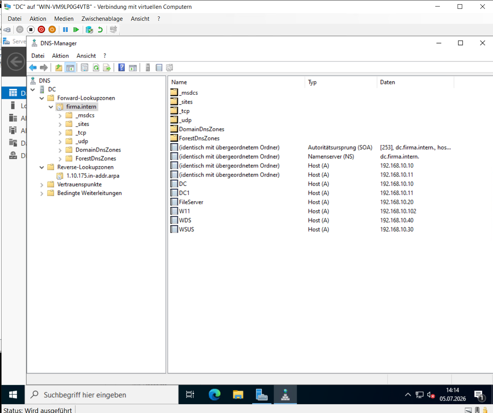
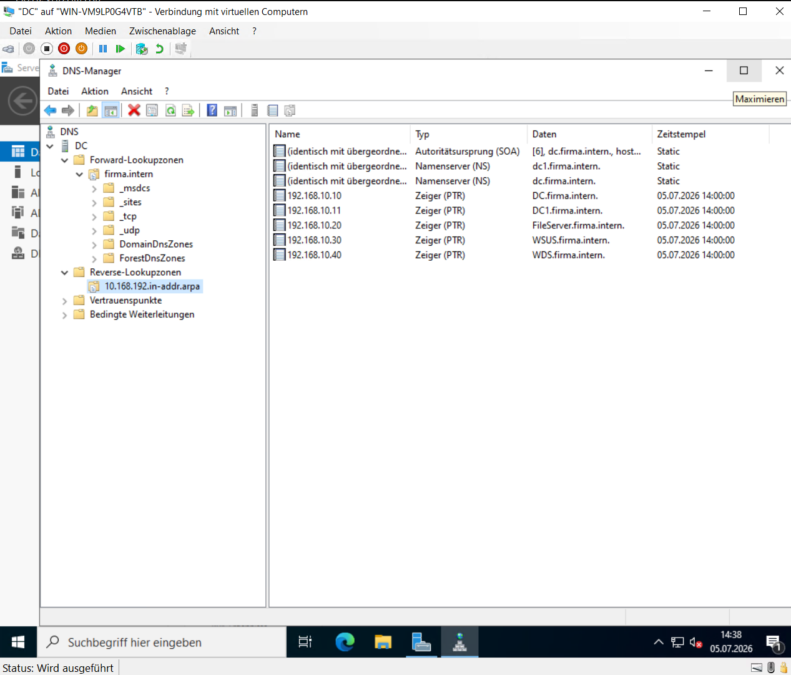

# DNS-Server

## Einleitung

Damit Server und Clients innerhalb der Domäne über Hostnamen miteinander kommunizieren können, wurde ein DNS-Server eingerichtet.

Der DNS-Dienst bildet eine wesentliche Grundlage für den Betrieb von Active Directory und ermöglicht die interne Namensauflösung innerhalb der Domäne **firma.intern**.

---

## Forward Lookup Zone

Für die Domäne **firma.intern** wurde eine Forward Lookup Zone eingerichtet.

Innerhalb dieser Zone werden die Hostnamen der Server und Clients den entsprechenden IP-Adressen zugeordnet. Dadurch können Systeme über ihren Namen anstelle der IP-Adresse erreicht werden.

**Abbildung 8: Forward Lookup Zone**

Die Forward Lookup Zone enthält die DNS-Einträge der Domäne und ermöglicht die Auflösung von Hostnamen in IP-Adressen.

---

## Reverse Lookup Zone

Zusätzlich wurde eine Reverse Lookup Zone für das Netzwerk **192.168.10.0/24** eingerichtet.

Sie ermöglicht die Auflösung von IP-Adressen in Hostnamen und unterstützt die Verwaltung sowie die Fehlersuche innerhalb der Infrastruktur.

**Abbildung 9: Reverse Lookup Zone**

Die Reverse Lookup Zone ermöglicht die Zuordnung von IP-Adressen zu den entsprechenden Hostnamen.

---

## Namensauflösung

Nach der Einrichtung wurde überprüft, ob sämtliche Server und Clients innerhalb der Domäne korrekt über DNS kommunizieren können.

Dabei wurde kontrolliert, dass:

- Hostnamen erfolgreich aufgelöst werden,
- die DNS-Zonen korrekt eingerichtet sind,
- alle Systeme innerhalb der Domäne erreichbar sind.

Die erfolgreiche Namensauflösung bildet die Grundlage für den fehlerfreien Betrieb der Active-Directory-Umgebung.
