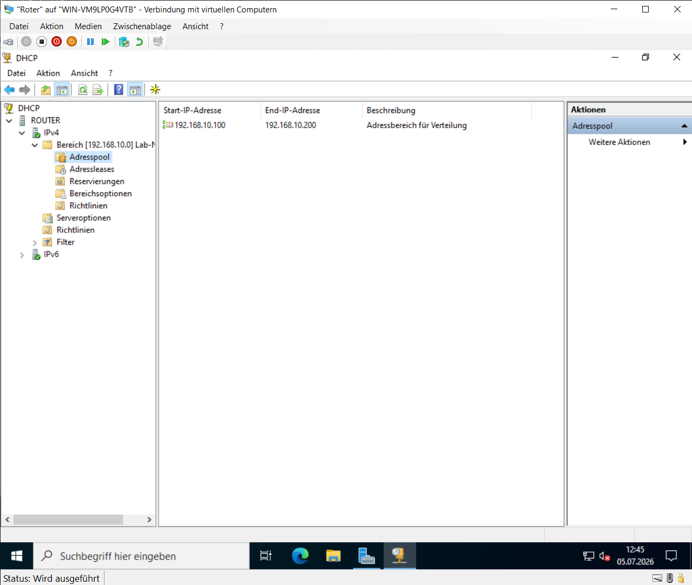
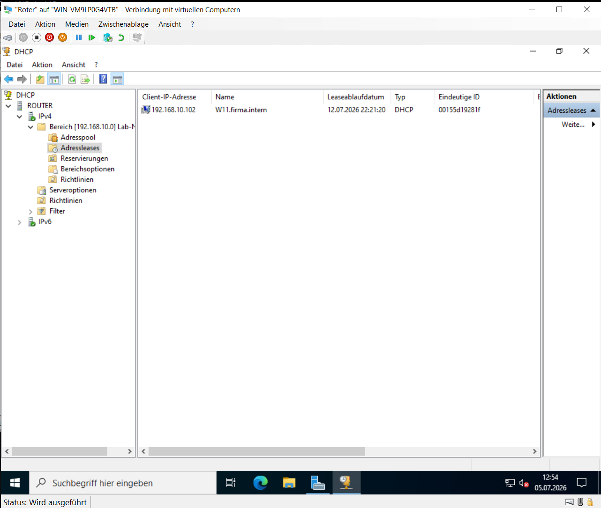
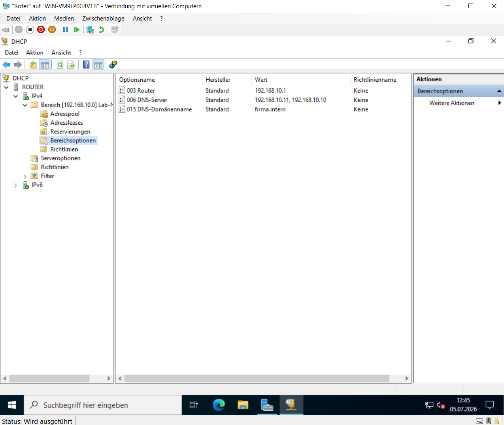

# DHCP-Server

## Einleitung

Damit neue Clients ihre Netzwerkkonfiguration automatisch erhalten, wurde ein DHCP-Server eingerichtet.

Der DHCP-Dienst vergibt IP-Adressen sowie weitere Netzwerkeinstellungen automatisch und ermöglicht dadurch eine einheitliche Einbindung neuer Systeme in die Domäne.

---

## Adressbereich

Für das Netzwerk **192.168.10.0/24** wurde ein DHCP-Adressbereich eingerichtet.

Die automatische Vergabe der IPv4-Adressen erfolgt innerhalb des Bereichs:

**192.168.10.100 – 192.168.10.200**

**Abbildung 10: DHCP-Adresspool**

Der konfigurierte Adresspool stellt sicher, dass neue Clients automatisch eine freie IP-Adresse erhalten.

---

## DHCP-Leases

Nach der erfolgreichen Konfiguration werden alle vergebenen IP-Adressen innerhalb der Lease-Verwaltung angezeigt.

Dadurch lässt sich nachvollziehen, welcher Client aktuell welche Adresse verwendet.

**Abbildung 11: DHCP-Leases**

Die Lease-Verwaltung dokumentiert sämtliche aktuell vergebenen IP-Adressen innerhalb des Netzwerks.

---

## DHCP-Optionen

Zusätzlich wurden DHCP-Optionen eingerichtet, damit neue Clients automatisch die erforderlichen Netzwerkeinstellungen erhalten.

Dazu gehören unter anderem:

- Standardgateway
- DNS-Server
- Domänenname

**Abbildung 12: DHCP-Optionen**

Über die DHCP-Optionen werden die benötigten Netzwerkinformationen automatisch an alle Clients verteilt.

---

## Überprüfung

Nach der Einrichtung wurde überprüft, ob neue Clients ihre Netzwerkkonfiguration automatisch erhalten.

Dabei wurde kontrolliert, dass:

- eine gültige IPv4-Adresse vergeben wird,
- die DHCP-Optionen übernommen werden,
- die Verbindung innerhalb der Domäne erfolgreich hergestellt werden kann.

Die automatische Adressvergabe funktionierte innerhalb der Laborumgebung fehlerfrei.
