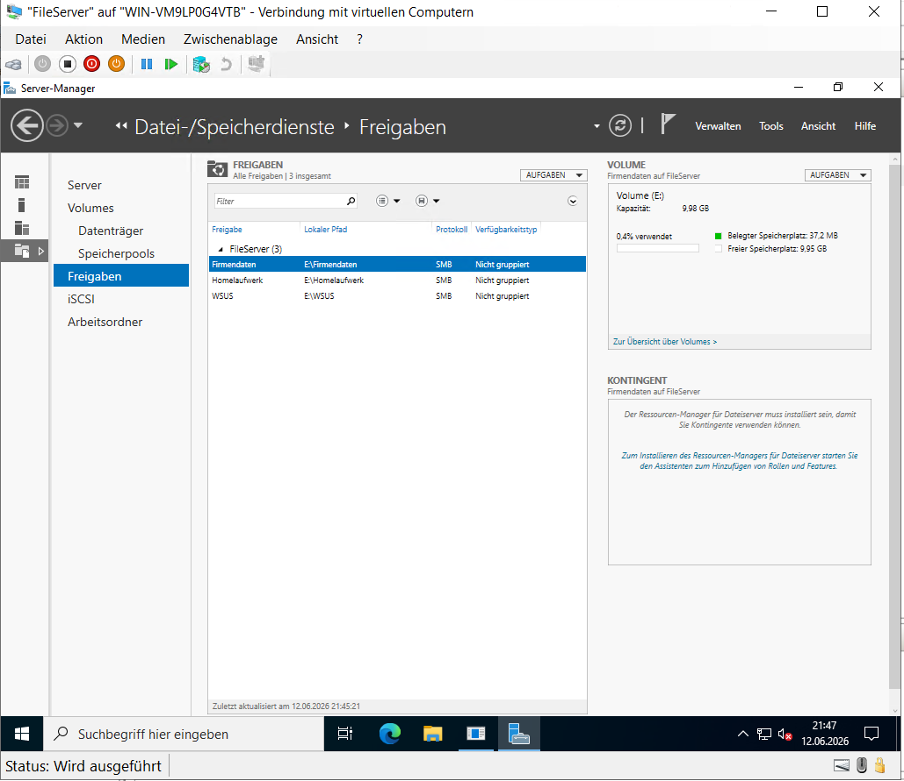
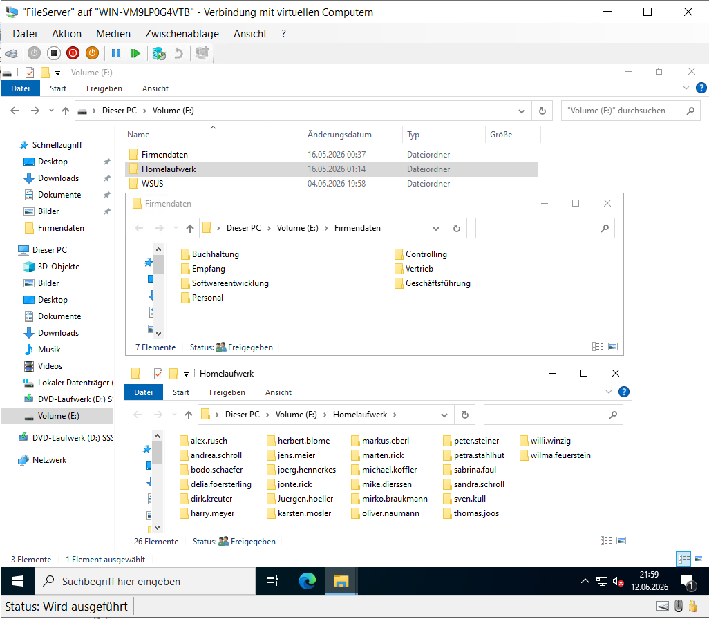
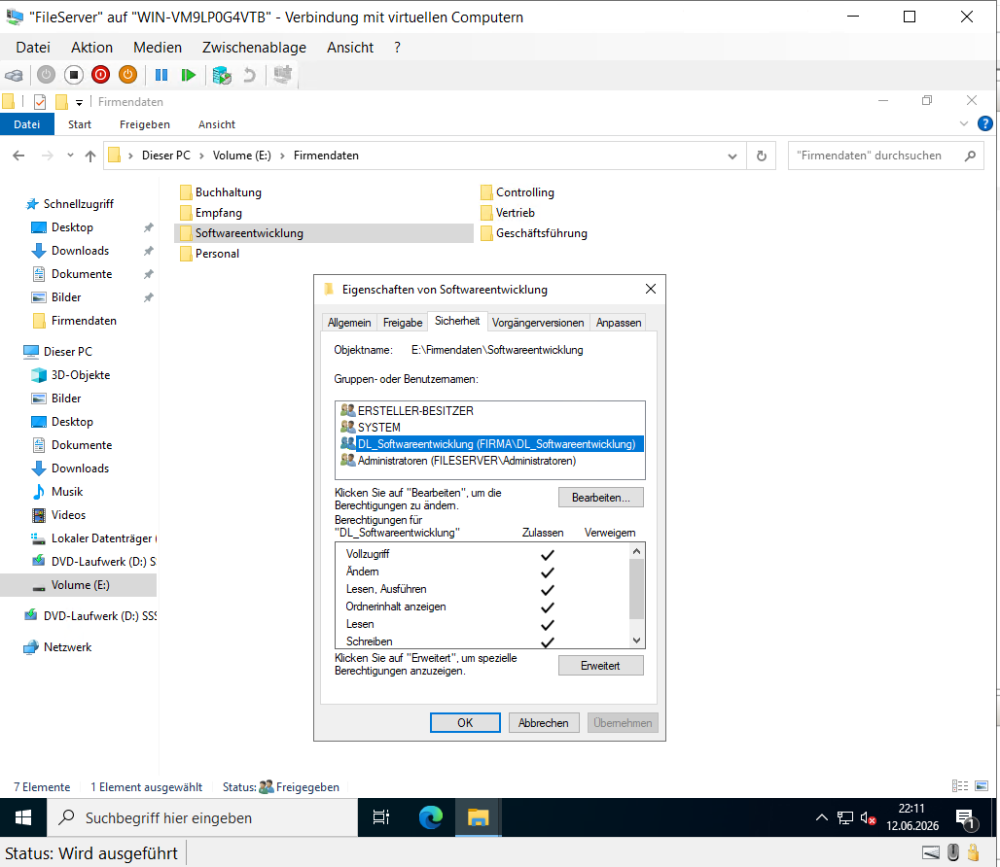
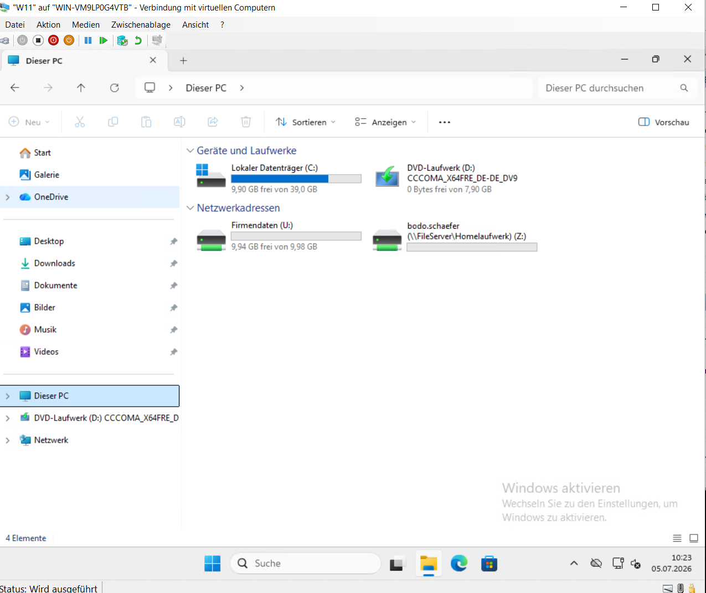
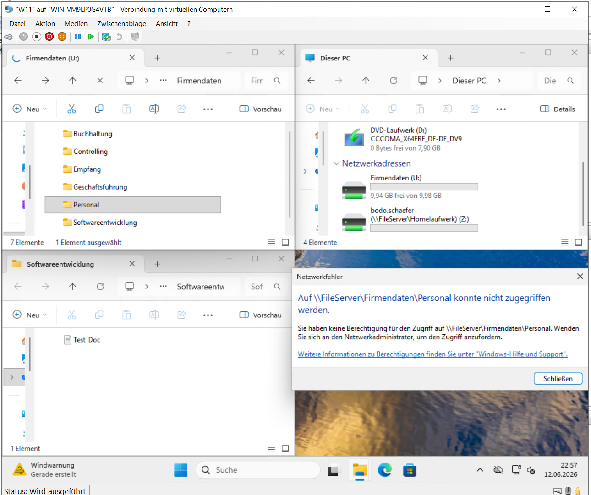

# Dateidienste und Berechtigungen

## Einleitung

Zur zentralen Bereitstellung von Unternehmensdaten wurde ein Dateiserver eingerichtet.

Neben gemeinsamen Abteilungsordnern wurden persönliche Homeverzeichnisse erstellt. Der Zugriff auf diese Ressourcen erfolgt ausschließlich über definierte Freigabe- und NTFS-Berechtigungen.

---

## SMB-Freigaben

Auf dem Dateiserver wurden zentrale SMB-Freigaben eingerichtet.

Über diese Freigaben können Benutzer entsprechend ihrer Berechtigungen auf gemeinsame Ressourcen innerhalb der Domäne zugreifen.

**Abbildung 13: SMB-Freigaben**

Die eingerichteten SMB-Freigaben stellen die zentralen Speicherbereiche der einzelnen Abteilungen bereit.

---

## Ordnerstruktur

Für jede Abteilung wurden eigene Verzeichnisse erstellt.

Zusätzlich wurden persönliche Homeverzeichnisse eingerichtet, auf die ausschließlich der jeweilige Benutzer Zugriff besitzt.

**Abbildung 14: Ordnerstruktur**

Die Ordnerstruktur ermöglicht eine übersichtliche Trennung der gemeinsam genutzten Daten sowie der persönlichen Benutzerverzeichnisse.

---

## NTFS-Berechtigungen

Die Zugriffsrechte wurden mithilfe von NTFS-Berechtigungen umgesetzt.

Die Vergabe der Berechtigungen erfolgt nicht direkt an Benutzer, sondern über Sicherheitsgruppen nach dem AGDLP-Prinzip.

**Abbildung 15: NTFS-Berechtigungen**

Durch die Kombination aus Sicherheitsgruppen und NTFS-Berechtigungen können Zugriffe zentral verwaltet werden.

---

## Zugriffskontrolle

Nach der Anmeldung an der Domäne werden die benötigten Netzlaufwerke automatisch bereitgestellt.

Zusätzlich wurde überprüft, dass Benutzer ausschließlich auf die für sie vorgesehenen Ordner zugreifen können.

**Abbildung 16: Netzlaufwerke**

Die Netzlaufwerke werden den Benutzern automatisch zur Verfügung gestellt.

---

**Abbildung 17: Überprüfung der Berechtigungen**

Der verweigerte Zugriff bestätigt die korrekte Umsetzung des Berechtigungskonzepts und verhindert unberechtigte Zugriffe auf freigegebene Ressourcen.
