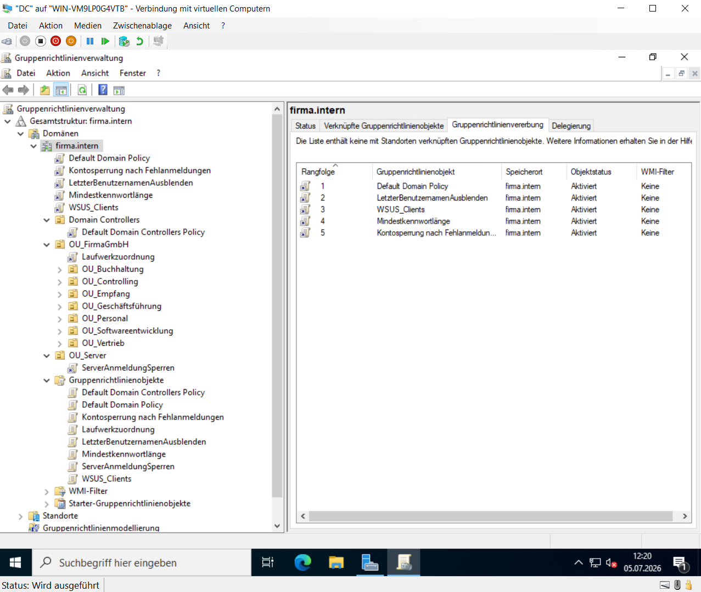
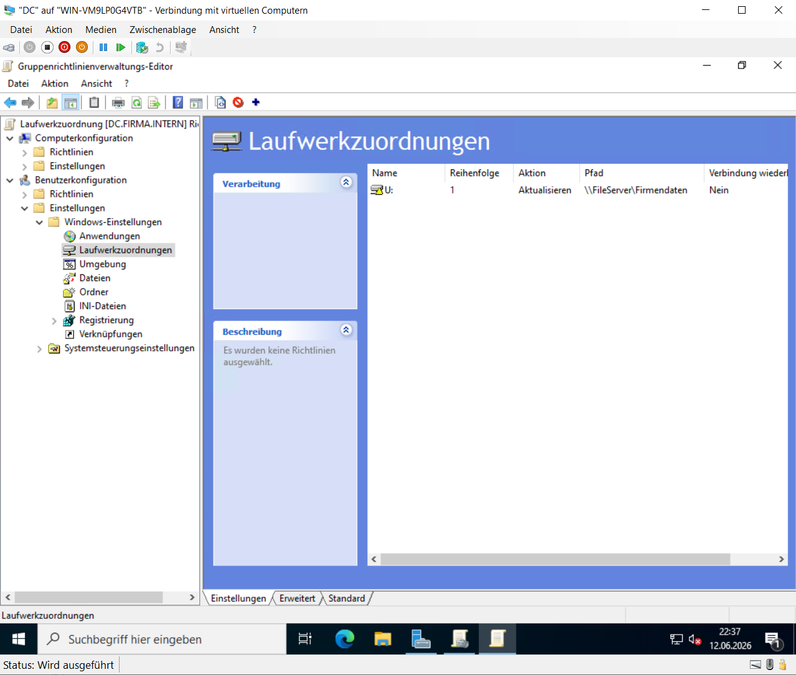

# Gruppenrichtlinienverwaltung

## Einleitung

Gruppenrichtlinien (Group Policy Objects, GPO) wurden eingerichtet, um Konfigurationen und sicherheitsrelevante Einstellungen zentral innerhalb der Domäne zu verwalten.

Dadurch können administrative Vorgaben automatisch auf Benutzer und Computer angewendet werden, ohne dass eine manuelle Konfiguration an jedem einzelnen System erforderlich ist.

---

## Konfigurierte Gruppenrichtlinien

Im Rahmen des Projekts wurden mehrere Gruppenrichtlinien erstellt und den entsprechenden Organisationseinheiten zugewiesen.

Unter anderem wurden folgende Richtlinien umgesetzt:

- Kennwortrichtlinie
- Kontosperrrichtlinie
- Ausblenden des zuletzt angemeldeten Benutzers
- Automatische Netzlaufwerkszuordnung
- WSUS-Clientkonfiguration
- Einschränkung der Serveranmeldung

**Abbildung 18: Übersicht der Gruppenrichtlinien**

Die Gruppenrichtlinienverwaltung zeigt die eingerichteten Richtlinien sowie deren Zuordnung innerhalb der Domäne.

---

## Netzlaufwerkszuordnung

Über eine Gruppenrichtlinie werden Netzlaufwerke automatisch den Benutzern zugewiesen.

Dadurch stehen die benötigten Freigaben unmittelbar nach der Anmeldung an der Domäne zur Verfügung, ohne dass eine manuelle Verbindung hergestellt werden muss.

**Abbildung 19: Automatische Netzlaufwerkszuordnung**

Die Richtlinie verbindet die vorgesehenen Netzlaufwerke automatisch mit den entsprechenden Benutzerkonten.

---

## Überprüfung

Nach der Konfiguration wurde überprüft, ob die eingerichteten Gruppenrichtlinien erfolgreich auf dem Windows-11-Client angewendet werden.

Hierzu wurde das Werkzeug **gpresult** verwendet.

**Abbildung 20: Überprüfung der Gruppenrichtlinien**

Die Ausgabe von **gpresult** bestätigt die erfolgreiche Anwendung der konfigurierten Gruppenrichtlinien auf dem Domänenclient.
