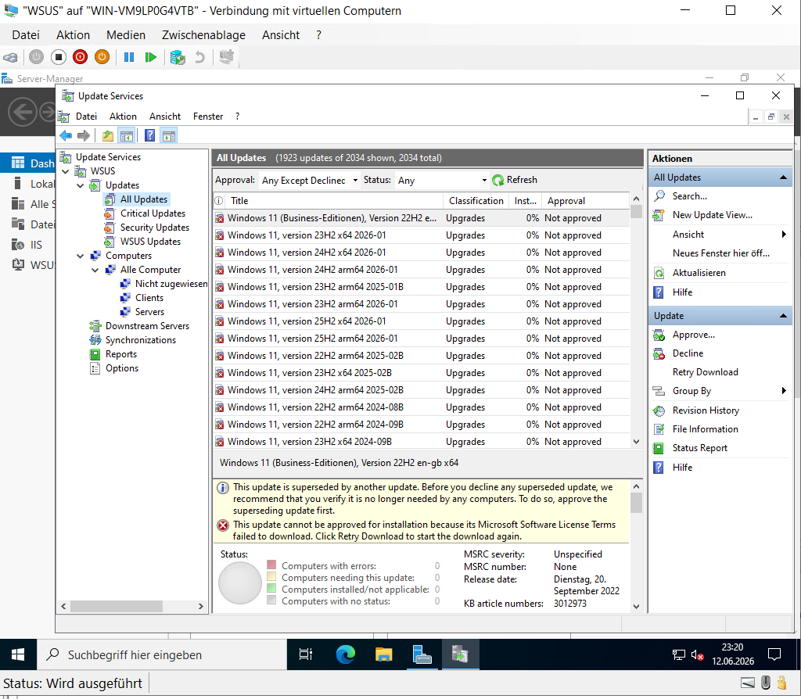

# Windows Server Update Services

## Einleitung

Zur zentralen Verwaltung von Windows-Updates wurde innerhalb der Domäne ein WSUS-Server (Windows Server Update Services) eingerichtet.

Dadurch können Updates zentral synchronisiert, verwaltet und den Domänenclients kontrolliert bereitgestellt werden.

---

## Installation und Konfiguration

Der WSUS-Dienst wurde auf einem eigenen Windows-Server installiert und anschließend konfiguriert.

Dabei wurden unter anderem folgende Einstellungen vorgenommen:

- Synchronisierung mit Microsoft Update
- Auswahl der benötigten Produkte
- Auswahl der Updateklassifizierungen
- Einrichtung von Computergruppen
- Konfiguration der Updateverwaltung

Nach der Konfiguration konnten sich die Domänenclients erfolgreich mit dem WSUS-Server verbinden.

---

## WSUS-Konsole

Die Verwaltung sämtlicher Updates erfolgt über die WSUS-Konsole.

Hier werden Synchronisierungen, Computergruppen sowie verfügbare Updates zentral verwaltet.

**Abbildung 21: Windows Server Update Services**

Die WSUS-Konsole zeigt die erfolgreiche Einrichtung des Update-Servers einschließlich der Synchronisierung sowie der zentralen Verwaltung der verfügbaren Windows-Updates.

---

## Überprüfung

Nach der Einrichtung wurde kontrolliert, ob:

- die Synchronisierung erfolgreich durchgeführt wurde,
- Produkte und Klassifizierungen verfügbar sind,
- Computergruppen eingerichtet wurden,
- Domänenclients den WSUS-Server erreichen können.

Die erfolgreiche Konfiguration bestätigt die zentrale Verwaltung der Windows-Updates innerhalb der Laborumgebung.
