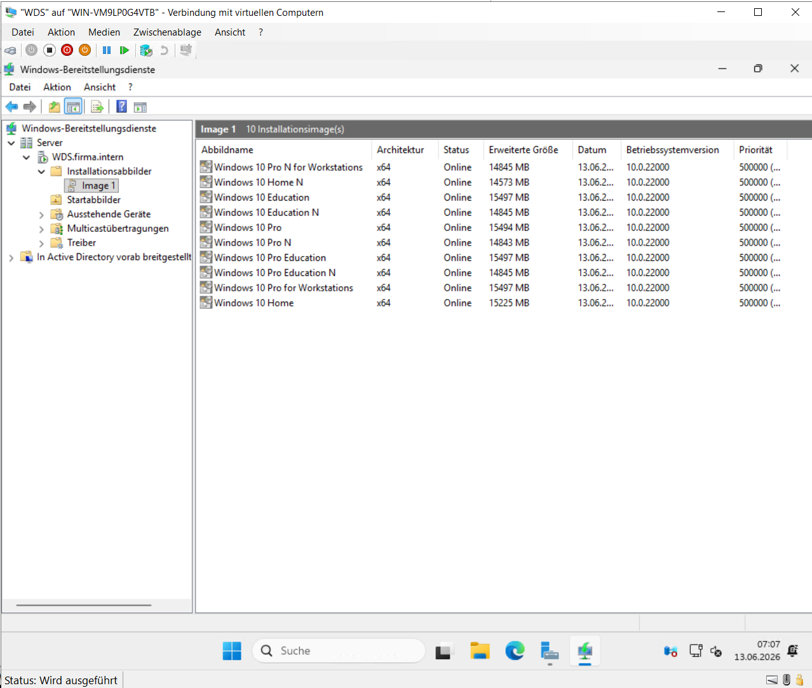
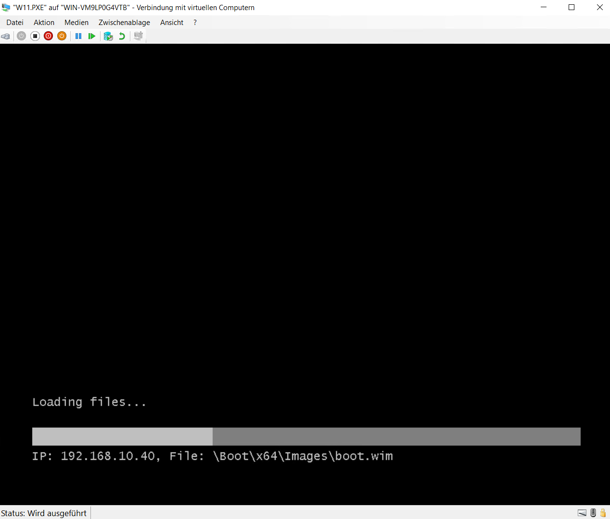

# Windows Deployment Services

## Einleitung

Zur zentralen Bereitstellung von Windows-Betriebssystemen wurde ein WDS-Server (Windows Deployment Services) eingerichtet.

Dadurch können neue Clients über das Netzwerk installiert werden, ohne dass lokale Installationsmedien verwendet werden müssen.

---

## Installation und Konfiguration

Für die Betriebssystembereitstellung wurde die Serverrolle **Windows Deployment Services (WDS)** installiert und konfiguriert.

Dabei wurden folgende Komponenten eingerichtet:

- WDS-Server
- Boot-Image
- Installationsabbild
- PXE-Boot
- Netzwerkbasierte Betriebssystembereitstellung

Nach der Konfiguration konnten neue Clients erfolgreich über PXE gestartet werden.

---

## Bereitstellung der Installationsabbilder

Die Boot- und Installationsabbilder wurden innerhalb der WDS-Konsole eingebunden und für die Bereitstellung freigegeben.

**Abbildung 22: Windows Deployment Services**

Die WDS-Konsole zeigt die eingerichteten Boot- und Installationsabbilder, welche für die netzwerkbasierte Windows-Installation verwendet werden.

---

## PXE-Start

Nach der Einrichtung wurde ein Windows-11-Testclient über das Netzwerk gestartet.

Der erfolgreiche PXE-Start bestätigt, dass der Client den WDS-Server erreicht und die Windows-Installation über das Netzwerk beginnen kann.

**Abbildung 23: PXE-Start eines Clients**

Die erfolgreiche Verbindung zum WDS-Server bestätigt die korrekte Konfiguration der netzwerkbasierten Betriebssystembereitstellung.

---

## Überprüfung

Zum Abschluss wurde kontrolliert, ob:

- der PXE-Start erfolgreich durchgeführt werden kann,
- Boot- und Installationsabbilder verfügbar sind,
- Clients den WDS-Server erreichen,
- die Windows-Installation über das Netzwerk gestartet werden kann.

Die durchgeführten Tests bestätigen die erfolgreiche Einrichtung der Windows Deployment Services.
