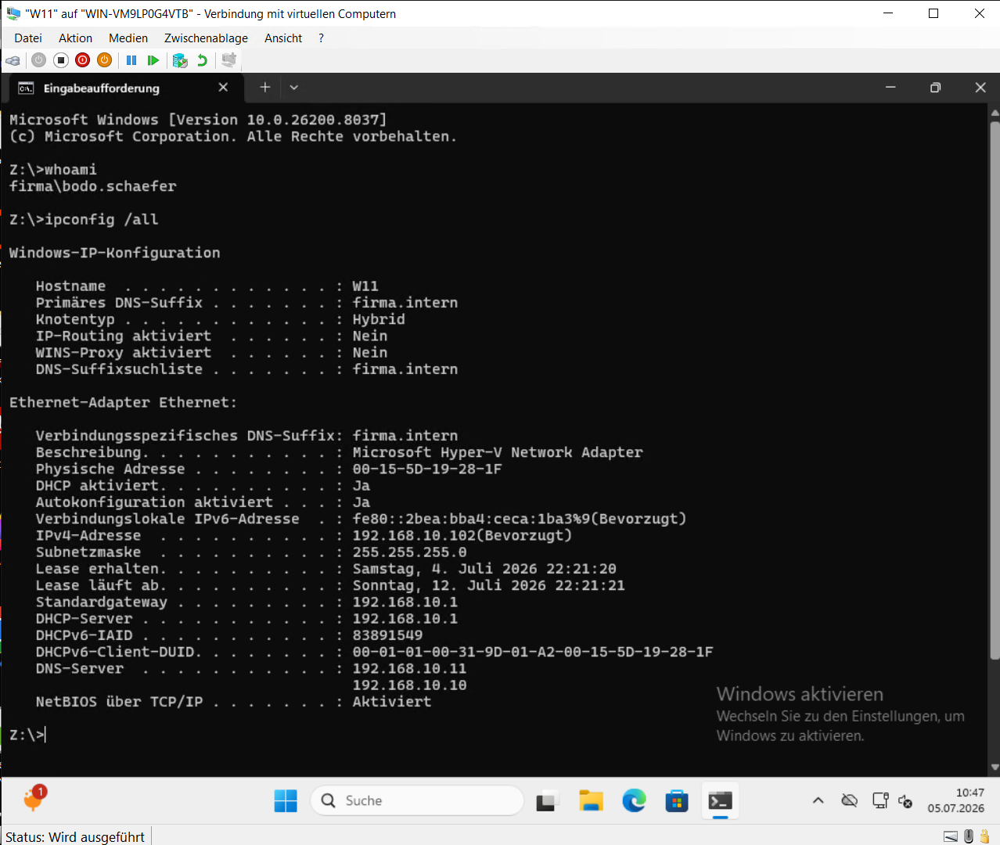
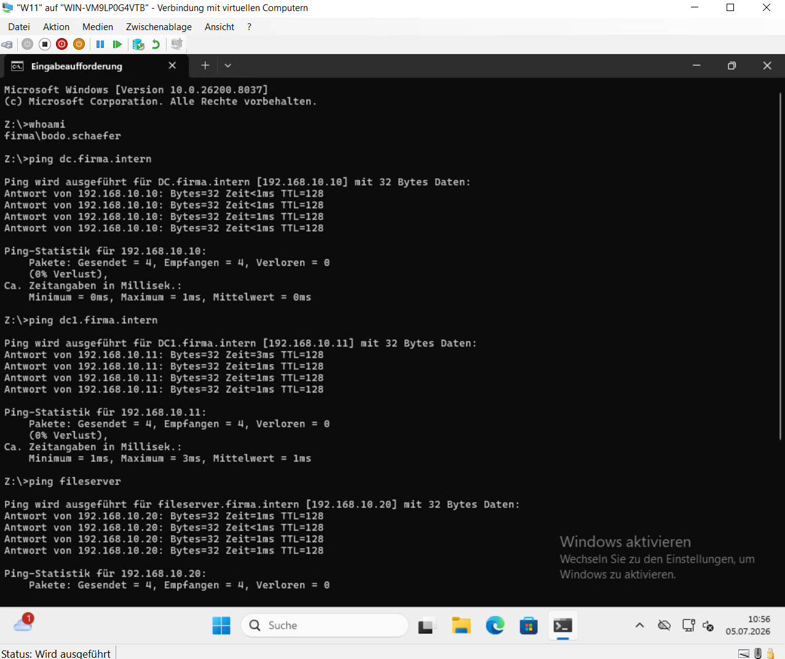
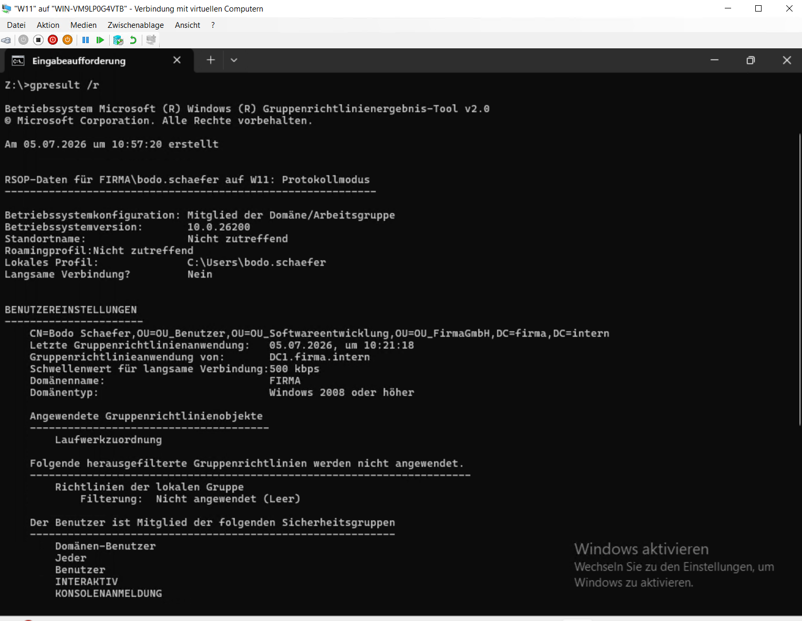

# Funktionsprüfung

## Einleitung

Nach der Einrichtung aller Serverrollen wurde die vollständige Windows-Server-Infrastruktur überprüft.

Ziel der Funktionsprüfung war es, sicherzustellen, dass sämtliche Dienste ordnungsgemäß zusammenarbeiten und die geplanten Funktionen innerhalb der Domäne zuverlässig bereitstellen.

---

## Durchgeführte Tests

Nach Abschluss der Konfiguration wurde die Funktion der eingerichteten Serverdienste überprüft.

Dabei wurden unter anderem folgende Tests durchgeführt:

- Anmeldung eines Domänenbenutzers an der Active-Directory-Domäne
- Überprüfung der DNS-Namensauflösung
- Automatische Vergabe einer IPv4-Adresse über DHCP
- Kommunikation zwischen den Servern und dem Windows-11-Client
- Anwendung der konfigurierten Gruppenrichtlinien
- Automatische Bereitstellung der Netzlaufwerke
- Zugriff auf freigegebene Ordner entsprechend der vergebenen Berechtigungen
- Verbindung der Domänenclients mit dem WSUS-Server
- PXE-Start eines Windows-11-Testclients über WDS

Alle durchgeführten Tests verliefen erfolgreich und bestätigten die ordnungsgemäße Zusammenarbeit der eingerichteten Serverdienste.

---

## Anmeldung und Netzwerkkonfiguration

Nach der Anmeldung an der Domäne wurde überprüft, ob der Windows-11-Client automatisch seine Netzwerkkonfiguration erhält.

**Abbildung 24: Anmeldung und Netzwerkkonfiguration**

Die Ausgabe bestätigt die erfolgreiche Domänenanmeldung sowie die automatische Vergabe der Netzwerkeinstellungen.

---

## Netzwerkkommunikation

Die Kommunikation zwischen den Servern und dem Windows-11-Client wurde anschließend mittels Ping überprüft.

**Abbildung 25: Netzwerkkommunikation**

Der erfolgreiche Ping-Test bestätigt die Erreichbarkeit der Systeme innerhalb der Domäne.

---

## Gruppenrichtlinien

Zur Kontrolle der angewendeten Gruppenrichtlinien wurde das Werkzeug **gpresult** verwendet.

**Abbildung 26: Überprüfung der Gruppenrichtlinien**

Die Ausgabe bestätigt die erfolgreiche Anwendung der konfigurierten Gruppenrichtlinien.

---

## Netzlaufwerke und Berechtigungen

Nach der Benutzeranmeldung wurden die Netzlaufwerke automatisch verbunden.

Anschließend wurde überprüft, ob ausschließlich berechtigte Benutzer auf die jeweiligen Freigaben zugreifen können.

**Abbildung 27: Automatisch verbundene Netzlaufwerke**

Die Netzlaufwerke stehen den Benutzern unmittelbar nach der Anmeldung automatisch zur Verfügung.

---

**Abbildung 28: Überprüfung der Zugriffsrechte**

Der verweigerte Zugriff bestätigt die korrekte Umsetzung des eingerichteten Berechtigungskonzepts.

---

## Zusammenfassung

Die durchgeführten Funktionstests bestätigen die erfolgreiche Implementierung der Windows-Server-Infrastruktur.

Alle Serverrollen arbeiten ordnungsgemäß zusammen. Benutzer können sich an der Domäne anmelden, erhalten automatisch ihre Netzwerkkonfiguration und greifen entsprechend ihrer Berechtigungen auf die bereitgestellten Ressourcen zu.
